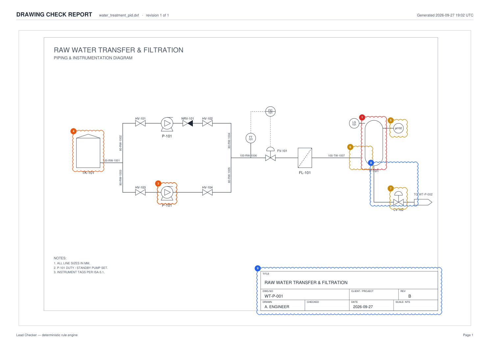
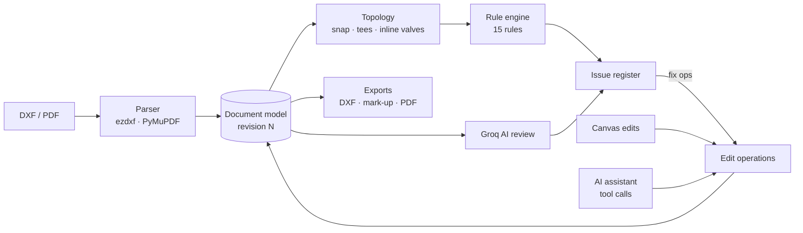

# Lead Checker — AI-assisted P&ID drawing checker

Automated lead-checker QA for piping & instrumentation diagrams. Upload an AutoCAD **DXF** (or a vector **PDF**),
and Lead Checker:

1. **extracts the CAD model** — symbols from block definitions, ISA-5.1 tags, line numbers, title block — and works
   out **pipe connectivity** from the geometry;
2. runs **15 deterministic engineering rules** (duplicate tags, open pipe ends, pumps without check valves, vessels
   without PSVs, broken control loops, …) and marks every finding on the drawing with a revision cloud;
3. adds an optional **Groq AI review** for problems the rules cannot express;
4. lets you **fix the drawing** — one-click auto-fixes, direct manipulation on the canvas, or by **chatting with an
   assistant that edits the CAD model through tool calls**. Every change is a revision you can undo;
5. **exports** a corrected DXF, a marked-up DXF (clouds on a `CHECKER` layer) and a PDF check report.



## Quick start

Prerequisites: Python 3.10+, Node 20+.

```bash
make setup      # venv + pip install, npm install, creates backend/.env
make dev        # API on :8000 (docs at /docs), UI on :5173
```

Open http://localhost:5173 and click **Open live demo** — a water-treatment P&ID with nine seeded errors.

<details>
<summary>Without make</summary>

```bash
cd backend
python3 -m venv venv && ./venv/bin/pip install -r requirements.txt
cp .env.example .env                       # optional: add GROQ_API_KEY
./venv/bin/uvicorn app.main:app --reload --port 8000

cd ../frontend
npm install
npm run dev                                # proxies /api to :8000 (override with API_URL=...)
```
</details>

### Enabling AI (optional)

Put a [Groq](https://console.groq.com) key in `backend/.env`:

```
GROQ_API_KEY=gsk_...
GROQ_MODEL=openai/gpt-oss-120b     # any Groq model with tool calling
```

Without a key everything except the AI review still works: the rule engine, auto-fix, exports, and the assistant,
which falls back to an offline command parser (`fix all`, `rename E7 to P-102`,
`add a check valve after P-102`, `add a level transmitter near TK-101 right`, `set checked by to J. SMITH`, `help`).

## A check, end to end

| Step | What happens |
|---|---|
| Upload / demo | DXF parsed → document model (revision 1). Rules run immediately; AI review starts in the background if enabled. |
| Review | Findings are numbered clouds on the canvas and cards in the issue register. Click either to zoom to the problem. |
| Fix | **Apply fix** on a card, **Auto-fix** for every mechanical fix, drag / retag / delete on the canvas, or ask the assistant (“add the missing transmitter and controller for LV-102 and wire the loop”). |
| Disposition | Mark findings **Accepted** (to be fixed) or **Rejected** (waived) with a comment. Findings that disappear after an edit are counted as **Fixed**. |
| Deliver | Export the corrected DXF, the marked-up DXF, or the PDF report with the issue register. |

## Rule catalogue

| ID | Rule | Severity | Needs DXF connectivity |
|---|---|---|---|
| R001 | Duplicate tag | HIGH | |
| R002 | Non-standard tag format (`pt102` → `PT-102`) | MEDIUM | |
| R003 | Tag prefix does not match symbol | MEDIUM | |
| R004 | Untagged equipment / instrument / control or relief valve | MEDIUM | |
| R005 | Unconnected equipment | HIGH | ✓ |
| R006 | Open pipe end (with “connect to nearest” fix) | MEDIUM | ✓ |
| R007 | Pump discharge without check valve | HIGH | ✓ |
| R008 | Pump suction/discharge without isolation valve | MEDIUM | ✓ |
| R009 | Tank / vessel without level instrument | HIGH | |
| R010 | Pressure vessel without PSV | CRITICAL | |
| R011 | Control valve without matching loop instrument | MEDIUM | |
| R012 | Instrument not connected | LOW | ✓ |
| R013 | Pipe run without line number | LOW | ✓ |
| R014 | Title block incomplete | LOW | |
| R015 | Overlapping symbols | LOW | |

Each finding carries a stable key (rule + object ids), a location, and — where the fix is mechanical — a list of
edit operations. Adding a rule is one decorated function in [`backend/app/rules/engine.py`](backend/app/rules/engine.py).

## How it works



- **One document model.** Each revision stores a JSON document: block geometry, components (block, insert point,
  rotation, scale, tag, label), pipes as ordered polylines (order = flow direction), background geometry and title
  block. Revisions are immutable, which makes undo/redo and “fixed since import” trivial.
- **Topology from geometry.** Pipe ends snap to symbol extents (tolerance scales with symbol size), meet other pipe
  ends or land on a pipe's middle (tees); valves drawn over an unbroken pipe are detected as inline. Nothing is stored,
  so edits can never leave connectivity stale.
- **Edit operations are the only way to change a drawing** — `move`, `rotate`, `set_tag`, `delete` (re-joins the pipe
  when an inline valve is removed), `add_entity`, `connect` (orthogonal routing), `insert_inline` (splits the pipe),
  `extend_line`, `set_line_number`, `set_title`. Rule fixes, canvas drags and AI tool calls all produce the same ops.
- **AI never fakes results.** The review returns findings labelled `AI` with the model's confidence; the chat assistant
  can only change the drawing through the edit-operation tools, and every tool result (including errors) goes back to
  the model.

## API

Interactive docs at `http://localhost:8000/docs`. Main endpoints (all under `/api`):

| Method | Path | |
|---|---|---|
| POST | `/drawings/upload`, `/drawings/demo` | import a drawing |
| GET | `/drawings`, `/drawings/{id}` | list · detail (document, topology, issues, revisions) |
| POST | `/drawings/{id}/edits` | apply edit operations → new revision |
| POST | `/drawings/{id}/head` | move to a revision (undo / redo / history) |
| POST | `/drawings/{id}/issues/{key}/fix`, `/drawings/{id}/autofix` | apply fixes |
| PUT | `/drawings/{id}/issues/{key}/review` | accept / reject / reopen with comment |
| POST | `/drawings/{id}/ai-review` | run the Groq review |
| GET/POST | `/drawings/{id}/chat` | assistant history · send a message |
| GET | `/drawings/{id}/export/{dxf\|markup-dxf\|report-pdf\|original}` | downloads |

## Project layout

```
backend/app/
  core/        geometry, symbol library & tag conventions, document model, topology, edit operations
  parsers/     DXF (ezdxf) and vector PDF (PyMuPDF) → document
  rules/       deterministic rule engine
  ai/          Groq review + tool-calling chat, offline command parser, assistant tools
  exporters/   DXF writer (corrected + mark-up), PDF check report (ReportLab)
  services.py  revisions, issue assembly, fixes, reviews;  api/endpoints.py  FastAPI routes
backend/tests/ pytest suite (parsers, topology, every rule, ops, exports, API, AI loop with a fake model)
frontend/src/  React + TypeScript + Tailwind: SVG CAD canvas, issue register, assistant, inspector
samples/       generated sample drawings (make samples)
docs/SPEC.md   definition of done
```

## Tests

```bash
make test      # pytest (backend) + tsc + oxlint (frontend)
```

## Limitations

- **DXF is the primary format.** Symbols are recognised from block names (`PUMP`, `GATE_VALVE`, `INSTR_BUBBLE`, …) or
  from a TAG attribute; drawings with exploded symbols are parsed, but their geometry cannot be classified.
- **PDF input** is vector-only and page 1; tags, instruments-by-proximity and the title block are checked, pipe
  connectivity is not. Scanned drawings and DWG are out of scope (convert DWG to DXF with the ODA File Converter).
- Flow direction is taken from pipe drawing order; where it is ambiguous, the pump rules fall back to direction-free
  checks.
- Single user, local SQLite storage.
